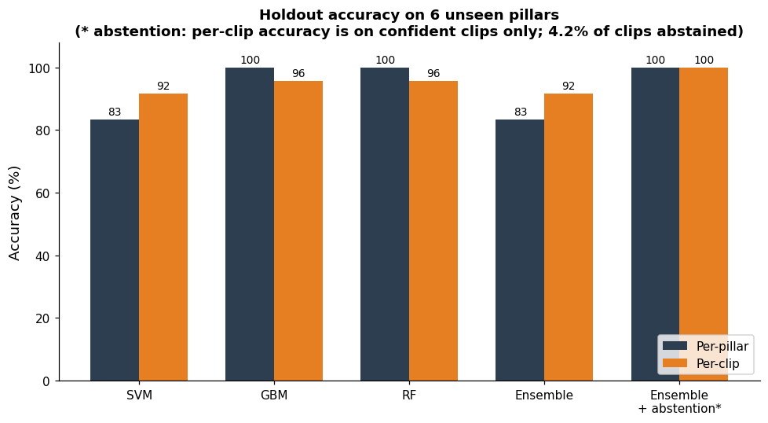
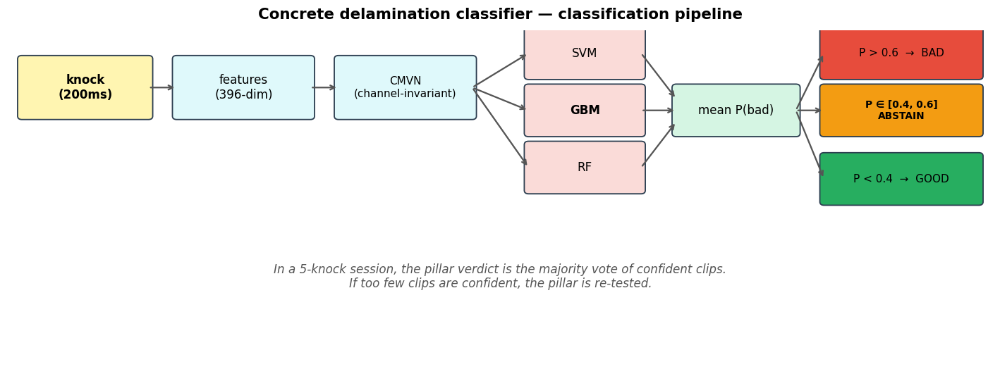
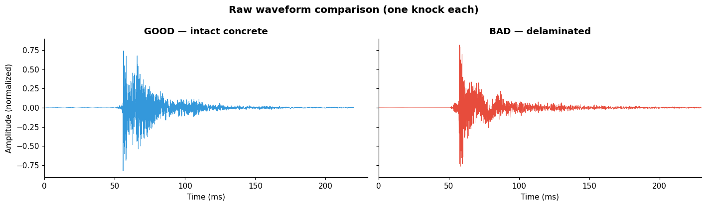
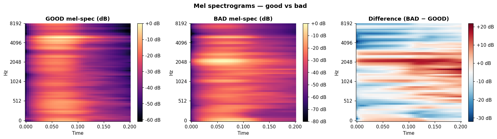
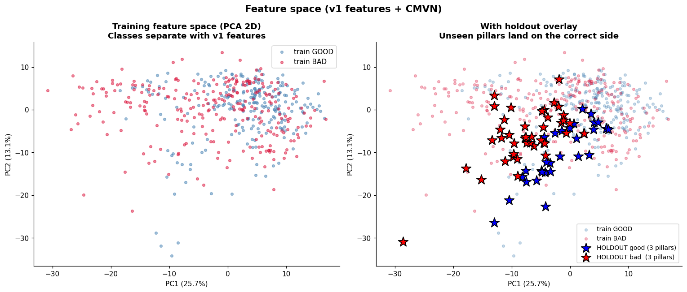
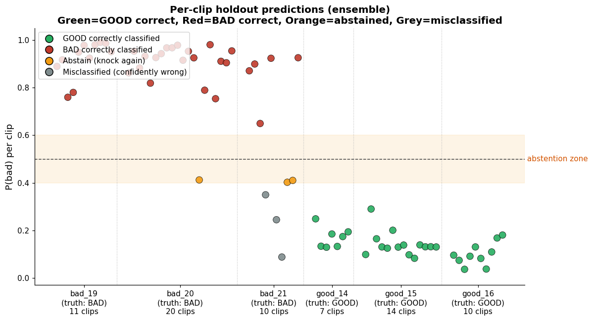
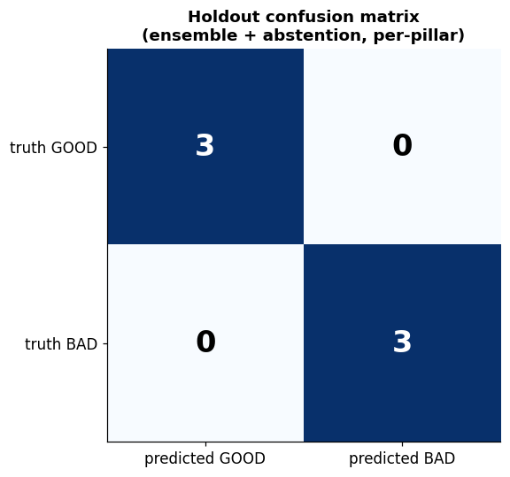

# Acoustic Delamination Detection

A binary classifier that distinguishes intact from delaminated concrete using the sound of a knock.

Concrete delaminates internally when water reaches the rebar and the resulting corrosion expands, opening a
void between the steel and the surface. The defect is invisible from outside. The standard field method for
locating it is the tap test: strike the surface and listen. Intact concrete rings; delaminated concrete
returns a flat, damped thud. Performing the test reliably requires a trained ear, which makes it a
reasonable candidate for automation.

This repository contains the dataset, the feature pipeline, and the model. 580 knock recordings across 37
concrete pillars are reduced to 396-dimensional feature vectors and classified by an ensemble of an RBF-SVM,
a gradient boosting model, and a random forest, with an abstention zone for low-confidence clips.

## Results

| | |
|---|---|
| Leave-one-pillar-out cross-validation, 31 pillars | 87.1% |
| 6 unseen pillars, per-pillar | 100% (6/6) |
| 6 unseen pillars, per-clip | 91.7% |



## Method

**Preprocessing.** Each recording is peak-normalized, and the onset is located as the first sample reaching
40% of peak amplitude. A 200 ms window is centred on that onset and zero-padded where it runs past the ends
of the clip. Audio is 16 kHz mono throughout, with a 64-band mel spectrogram at hop length 64 and an 8 kHz
ceiling, converted to decibels relative to the per-clip maximum.

**Per-clip CMVN.** Normalizing each mel spectrogram to zero mean and unit variance per frequency band
removes the constant channel response of the microphone and room. The technique is standard in speech
recognition, where the equivalent problem is the same speaker recorded over different transmission channels.

**Augmentation ×5.** Each training clip is expanded into five: volume jitter (±6 dB, for source distance),
additive Gaussian noise (20–35 dB SNR, for room noise), onset jitter (±10 ms, for windowing error), and
pitch shift (±0.4 semitones, for resonance variation). This trains for invariance to recording conditions
without collecting further data. Holdout clips are never augmented.

**396 features.** Mel mean and standard deviation, CMVN-normalized mel mean and standard deviation, and
delta-mel mean and standard deviation account for 384 dimensions. The remainder are a decay time τ fitted to
the post-onset RMS envelope, eight spectral shape descriptors (centroid, spread, skewness, kurtosis, 85th
and 95th percentile rolloff, flatness, slope), and three temporal descriptors (rise time, zero-crossing
rate, envelope kurtosis). τ is the physically motivated feature: intact concrete dissipates vibrational
energy slowly, delaminated concrete dissipates it rapidly.

**Three classifiers.** An RBF-SVM (C=5, γ=0.001) for smooth nonlinear boundaries, gradient boosting (100
depth-2 estimators) for feature interactions, and a random forest (200 trees) for noise tolerance, averaged
over `P(bad)`. At 31 pillars there is insufficient data to identify the correct inductive bias in advance,
so averaging across three reduces the cost of choosing wrongly.

**Abstention.** Clips falling in `P(bad) ∈ [0.4, 0.6]` are excluded from the vote, and the pillar verdict is
the majority of the remaining clips. A prediction at 51% carries different information from one at 99% and
is not treated as equivalent.



## Dataset

580 recordings, mono, 16 kHz, each containing one knock of roughly 0.15–0.58 seconds.

```
data/
├── good/      245 clips, 13 pillars    intact concrete
├── bad/       263 clips, 18 pillars    delaminated
├── holdout/    72 clips,  6 pillars    good 14–16, bad 19–21
└── raw/                                unsegmented .m4a source recordings
```

Filenames encode pillar and knock: `goodConcrete3-07.wav` is the 7th knock on good pillar 3. The holdout
subdirectories carry a trailing digit left by the segmentation script that split them out of the `.m4a`
originals, so `bad_194/` is pillar 19 and `good_144/` is pillar 14. The notebooks strip it before reporting.





The class difference is partially visible in the spectrograms, with intact knocks retaining low-band energy
longer, but it is not consistent enough across 580 clips to be applied by inspection.

## Evaluation protocol

Evaluation is leave-one-pillar-out, never a random clip-level split. All clips from a single pillar share a
recording session, a microphone position, and one physical piece of concrete, so a random split places
near-duplicates on both sides of the partition and inflates the result substantially.

The six holdout pillars were separated at the start and used once, in the final evaluation cell. No feature,
hyperparameter, model, or threshold was selected with reference to them. The notebook asserts that no pillar
ID appears in both partitions before evaluating.



## Detailed results

Six held-out pillars:

| Configuration | Per-pillar | Per-clip |
|---|---|---|
| Ensemble, threshold 0.5 | 83.3% (5/6) | 91.7% (66/72) |
| Ensemble with abstention | 100% (6/6) | 91.7% |
| Gradient boosting alone | 100% (6/6) | 95.8% |
| Random forest alone | 100% (6/6) | 95.8% |
| SVM alone | 83.3% (5/6) | 91.7% |

Mean `P(bad)` was approximately 14% on intact pillars and 82% on delaminated ones. 3 of 72 clips abstained,
a rate of 4.2%, corresponding to roughly one knock in a five-knock sequence.



Within distribution, leave-one-pillar-out over the 31 training pillars gives 87.1% for the ensemble and
93.5% for the random forest alone.

The two headline figures measure different quantities and are reported together. 87.1% covers 31 pillars
spanning a range of recording conditions; 100% covers six pillars, a sample small enough that a single
additional error would reduce it to 83%. Either figure quoted alone misrepresents the result.

### Failure case: bad_21

`bad_21` is the only pillar the ensemble misclassifies at threshold 0.5. Of its ten clips, five are labelled
intact, giving a mean `P(bad)` of 58% and a tied vote resolved incorrectly. Under abstention, three
borderline clips are removed and the remaining seven split 4–3 toward the correct verdict, which is a narrow
margin. Gradient boosting and the random forest each classify it correctly without assistance; the SVM
accounts for most of the error in the average.

The pillar warrants physical inspection. A plausible explanation is genuinely marginal delamination, such as
an early-stage or thin void, in which case the model is responding to a real property of the sample.



## Running the notebooks

Python 3.14 with librosa, scikit-learn, numpy, and matplotlib.

```bash
python3 -m venv .venv
.venv/bin/pip install -r requirements.txt
```

Train and evaluate. The first run takes about ten minutes, most of it feature extraction; subsequent runs
take about five once features are cached to `model/`.

```bash
.venv/bin/jupyter nbconvert --to notebook --execute --inplace \
  --ExecutePreprocessor.timeout=900 notebooks/Ensemble_Abstention_Model.ipynb
```

Regenerate the figures. This reads the feature cache, so the model notebook must be run first.

```bash
.venv/bin/jupyter nbconvert --to notebook --execute --inplace \
  --ExecutePreprocessor.timeout=300 notebooks/Data_Visualization.ipynb
```

| Notebook | Contents |
|---|---|
| `Ensemble_Abstention_Model.ipynb` | Feature extraction, augmentation, LOPO cross-validation, final fit, and holdout evaluation, with the reasoning for each step. The final cell classifies an arbitrary audio file. |
| `Data_Visualization.ipynb` | Generates the nine figures in `figures/`. |

The notebooks locate the project root by walking up from the working directory until `data/` and `model/`
are found, so they run from any location within the repository. Committed outputs come from a full run with
no cache present, and the figures above were generated from that same run.

Two sources of run-to-run variation are worth noting. Gradient boosting and the random forest are seeded,
but the final `SVC(probability=True)` is not, and its Platt calibration runs an unseeded internal
cross-validation, so mean `P(bad)` values shift by a few tenths of a point between runs. Separately, the
augmentation RNG is seeded once at import rather than per clip, so executing cells out of order changes
which noise draw is applied to which clip. Class decisions and every accuracy figure quoted above are
stable across runs; only the mean probabilities move.

## Limitations

31 pillars is the binding constraint. The relevant sample size is pillars rather than the 508 training
clips, since clips from one pillar are not independent observations. Augmentation instead of additional
model capacity, three sklearn models instead of a neural network, and a six-pillar holdout instead of a
conventional test set are all consequences of that number.

Six holdout pillars is a small test. 6/6 is the strongest available result at this sample size and carries
correspondingly wide error bars.

Recording conditions are uncontrolled. All recordings were taken handheld. A fixed mounting jig would remove
most of the remaining variance and would likely yield more improvement than further modelling.

Binary labels compress a continuous property. Delamination varies in severity, and `bad_21` illustrates the
result of forcing a marginal case into two classes.

Further work, in order of expected value: 50 or more pillars per class recorded under at least three
distinct conditions, a fixed recording jig, and severity as an ordinal label in place of a binary one.

## Repository layout

```
notebooks/     model and figure generation
data/          580 wav clips and raw source recordings
figures/       the nine figures used above
model/         feature cache, generated on first run (gitignored)
```

## License

MIT, see [LICENSE](LICENSE). The audio recordings are covered by the same terms; attribution is appreciated
if the dataset is reused.
